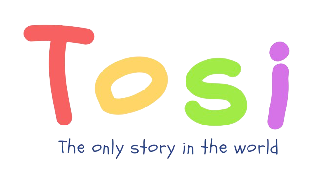
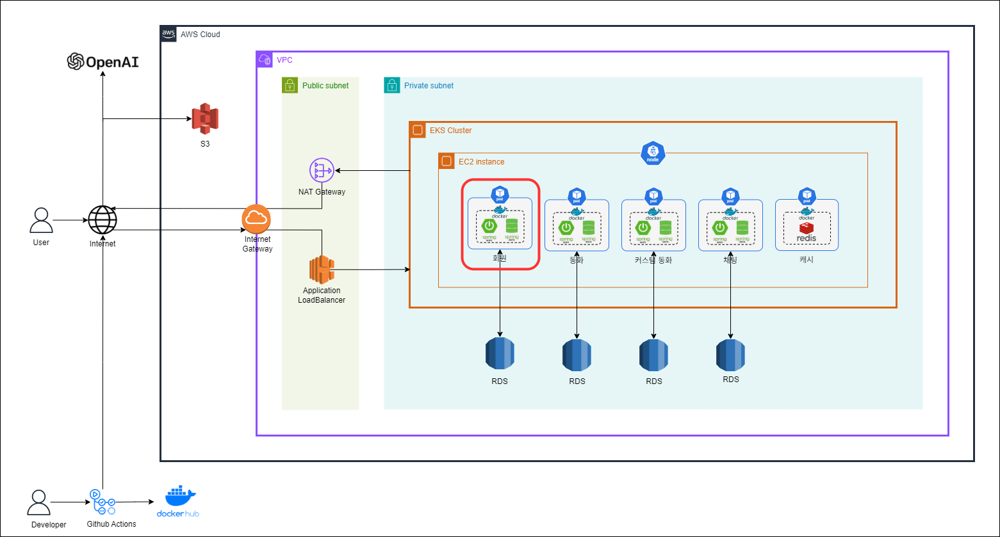

# :rabbit: TOSI(The Only Story In the world)를 소개합니다. :tada:

</img>

**TOSI는 어린이들이 혼자서도 재미있게 독서할 수 있는 인터랙티브 동화 구연 서비스입니다.**  
저희 서비스를 통해 '토씨 하나 빼놓지 않고' 이야기에 집중할 수 있습니다.  
**TOSI-User**은 토씨에서 회원과 관련된 기능을 **회원 서비스**로 분리한 프로젝트 입니다.

# :sparkle: 서비스 목표

동화 **등장인물의 이름을 아이의 이름으로 바꿔** TTS로 읽어주며,  
아이 혼자서도 동화에 몰입할 수 있어 미디어 소비 대신 독서 습관 형성을 돕습니다.

동화가 끝나면 OpenAI API를 활용해 **원하는 등장인물과 채팅**하면서,  
동화 속 캐릭터들과 상호작용하여 어휘력 및 사회성을 향상시킵니다.

**원하는 키워드와 배경**으로 OpenAI API를 활용해 **커스텀 동화를 제작**하면서,  
매번 새로운 이야기와 삽화로 아이의 상상력을 자극합니다.

# :date: 기간

_SSAFY 10기 공통 프로젝트_  
**2024.01.03 - 2024.02.16 (7주)**  
 우수상🏆

_1차 리팩토링_  
**24.09.09 - 24.10.18**

_2차 리팩토링_  
**25.02.06 - 25.02.23**

## :computer: Team. 먼똑귀

| 이름         | 역할          | 기능                                                                                                                                                                                                |
| ------------ | ------------- | --------------------------------------------------------------------------------------------------------------------------------------------------------------------------------------------------- |
| 천우진(팀장) | BE, FE        | 일반 동화 관리, 메인페이지 UI 구성                                                                                                                                                                  |
| 우지민       | BE, FE        | TTS 재생/정지/배속/볼륨 적용, TTS 제어 UI 구성                                                                                                                                                      |
| 김다윤       | BE, FE, INFRA | 등장인물을 회원 이름으로 변경, 회원 관심 동화 관리, 이름 선택 및 동화책 UI 구성   1차 리팩토링: MSA 마이그레이션, 쿠버네티스 도입, AWS EKS 배포  2차 리팩토링: Redis 도입, MSA 공통 로직 설계 |
| 양성주       | BE, FE        | 커스텀 동화 생성 및 저장, (비)공개 커스텀 동화 관리, 커스텀 동화 제작 UI 구성                                                                                                                       |
| 이아진       | BE, FE, INFRA | 등장인물과의 채팅, 채팅방 UI 구성, AWS EC2 배포                                                                                                                                                     |
| 김소연       | BE, FE        | JWT 기반 회원 인증 및 인가, 로그인/회원가입/마이페이지 UI 구성                                                                                                                                      |

## :pushpin: TOSI 서비스 아키텍처

## :deciduous_tree: TOSI-User 기술 스택

| Section      | Stack                                                                                                                                                                                                                                                                                                                                                                                                                                                                                                                                                                                                              |
| ------------ | ------------------------------------------------------------------------------------------------------------------------------------------------------------------------------------------------------------------------------------------------------------------------------------------------------------------------------------------------------------------------------------------------------------------------------------------------------------------------------------------------------------------------------------------------------------------------------------------------------------------ |
| **Backend**  |      |
| **Database** |                                                                                                                                                                                                                                                                                                                                                                                                        |
| **Infra**    |                        |
| **DevTool**  |                        |
